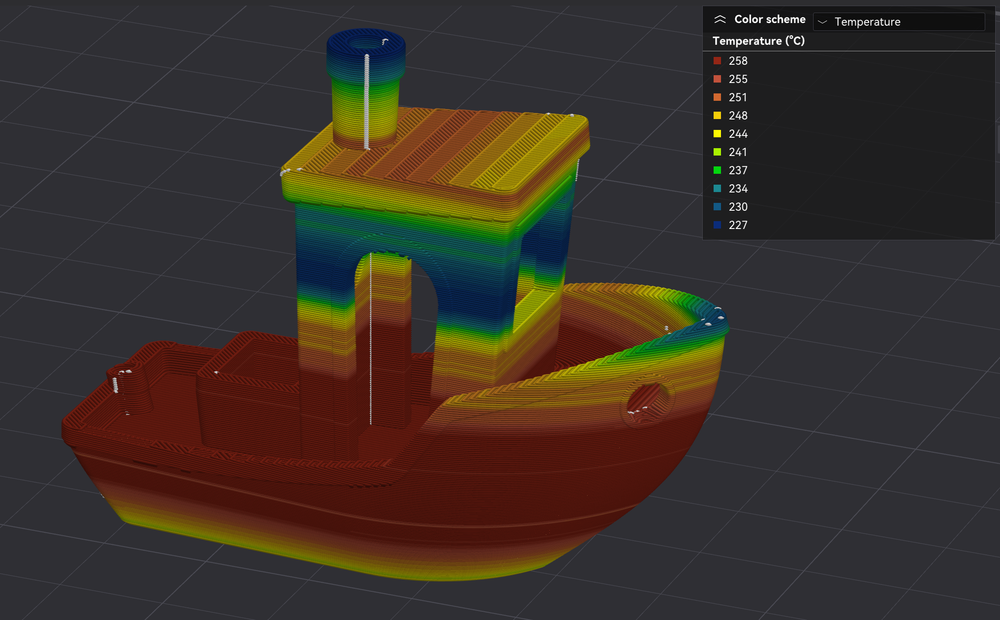

# MZ Flow Temp Processor

A Python post-processor for 3D printer G-code files, implementing advanced flow and temperature smoothing for improved print quality and layer adhesion.




---

## Features

- Extracts extrusion moves and calculates flow rates from G-code.
- Smooths flow and dynamically adjusts nozzle temperature based on predicted flow demand.
- Clamps feedrate to avoid exceeding the printer's maximum volumetric flow capability.
- Real-time plotting of flow and temperature profiles.
- Integrates as a post-processing script with popular slicers (OrcaSlicer for now, others to come).
- Reads required print and script-specific parameters from G-code comments or config blocks.
- Optionally relaunches the slicer viewer after processing.

---

## Installation

**Requirements:**
- Python 3
- numpy
- matplotlib
- PyQt5
- psutil

**Install dependencies:**

Linux:
```bash
sudo apt install python3-matplotlib python3-numpy python3-pyqt5 python3-psutil
```

Windows:
```cmd
pip install matplotlib numpy PyQt5 psutil
```

---

## Usage

```bash
python mz_flow_temp.py <input.gcode>
```
or
```bash
python3 mz_flow_temp.py <input.gcode>
```

---

## Slicer Integration Guide

### OrcaSlicer

1. Go to **Printer Settings > Machine G-code** and add:

    ```; MZ FLOW TEMP START``` at the **end** of **Machine start G-code**

    and

    ```; MZ FLOW TEMP END``` at the **beginning** of **Machine end G-code**

    

2. Then go to **Printer Settings > Notes** and add:
    ```
    mz_flow_temp_sec_per_c_heating = 6
    mz_flow_temp_sec_per_c_cooling = 4
    mz_flow_temp_launch_viewer = true
    ```
    

3. In the **Filament profile**, set your own values (these will be used by the script):

    
    
    
    

4. Add the command to **Print process > Others > Post-processing scripts** (adjust the path as needed):

    ```bash
    python3 <path to script>/mz_flow_temp.py
    ```
    or
    ```bash
    python <path to script>/mz_flow_temp.py
    ```

    

---

## ⚠️ Note about OrcaSlicer Viewer ⚠️

**OrcaSlicer does not display the post-processed G-code after the script runs.**  

To work around this, the script can automatically relaunch OrcaSlicer as a viewer for the processed file after processing is complete (unless you close the plot window with ESC).  

This ensures you see the updated G-code and temperature/flow changes in the slicer preview.

If you do not want the viewer to relaunch, simply close the plot window with the ESC key or disable this function permanently with
```mz_flow_temp_launch_viewer = false```

## Viewer Launch Behavior

- **If you close the plot window with the ESC key:**  
  The viewer will **not** be launched.
- **If you close the plot window with the window close (cross) icon or press Q:**  
  The viewer **will** be launched (if enabled in settings).

This allows you to skip launching the viewer if you want to quickly exit after reviewing the plot.

---

### Other Slicers

- The script is designed to work with OrcaSlicer. Other slicers might work but not tested yet.

---

## Required G-code Parameters

Ensure your G-code includes the following parameters:

```gcode
; nozzle_temperature_range_high = 260
; nozzle_temperature_range_low = 220
; filament_diameter = 1.75
; slow_down_min_speed = 30
; filament_max_volumetric_speed = 12  
; nozzle_temperature_initial_layer = 240
; initial_layer_print_height = 0.2
```

And in your printer_notes block, include:

```
mz_flow_temp_sec_per_c_heating = 6
mz_flow_temp_sec_per_c_cooling = 4
mz_flow_temp_launch_viewer = true
```

---

## How It Works

- The script parses your G-code, extracts extrusion moves, and calculates flow rates.
- It smooths flow transitions and dynamically adjusts nozzle temperature based on predicted flow demand.
- Feedrate is clamped to avoid exceeding the printer's maximum volumetric flow.
- Real-time plots visualize flow and temperature profiles during processing.
- The processed G-code is saved, and optionally, your slicer viewer is launched.

## What to expect

This tool automatically analyzes your print and makes small adjustments to the flow and nozzle temperature to help your printer keep up with changes in flow. 

Temperature changes are made gradually, not instantly, because the printer's heater takes time to respond - so you won't see sudden jumps, but smooth transitions. This helps prevent issues like under extrusion and improves layer bonding, especially on complex or fast prints. 

After running the script you can preview the changes in your slicer if enabled.

---

## Exit Codes

| Code | Meaning                                 |
|------|-----------------------------------------|
| 0    | Success                                 |
| 1    | Incorrect usage (missing arguments)     |
| 2    | Input file not found                    |
| 3    | Missing EXECUTABLE_BLOCK markers        |
| 4    | Missing MZ FLOW TEMP markers            |
| 5    | Error parsing settings from G-code      |
| 6    | Missing required parameters             |
| 7    | No moves found in G-code                |
| 8    | Error writing processed G-code file     |
| 9    | Unhandled exception                     |

---

## Troubleshooting

- **No plots or output:** Ensure all dependencies are installed and your G-code includes the required parameters and markers.
- **Script not running in slicer:** Double-check the post-processing script path and permissions.
- **Incorrect temperature/flow:** Verify your filament and printer settings in the slicer match your hardware.

---

## License

GPL v3

---
## Support the project
[](https://ko-fi.com/yurymonzon)

If you found this project useful, consider supporting my work with a small donation: https://ko-fi.com/yurymonzon Your support is greatly appreciated!

---

## Author

Developed by Yury MonZon with inspiration and ideas from BELAYEL Salim, creator of the original temperature controller application https://github.com/sb53systems/G-Code-Flow-Temperature-Controller . Support him too!


